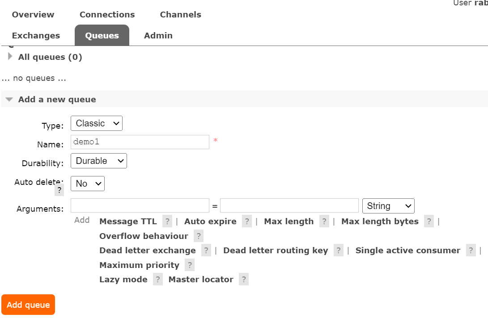
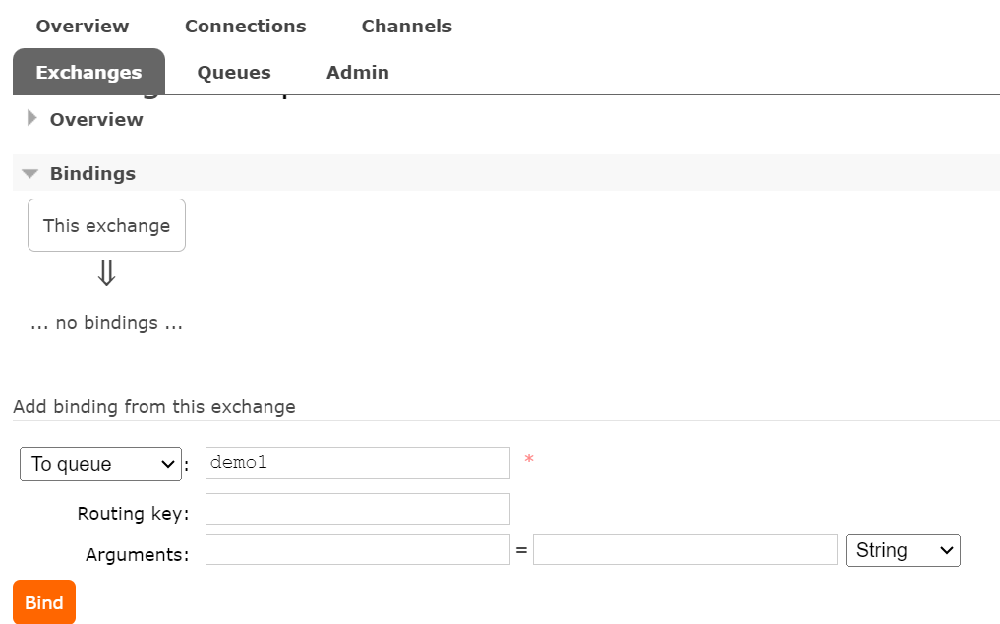
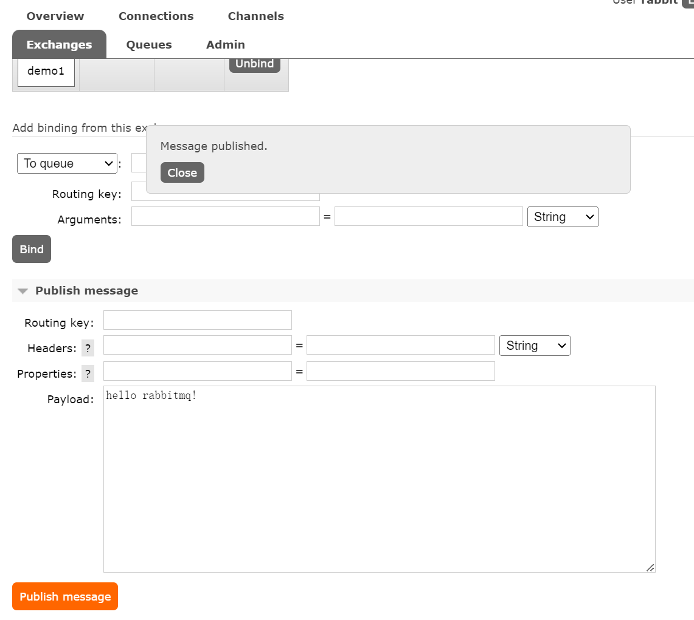
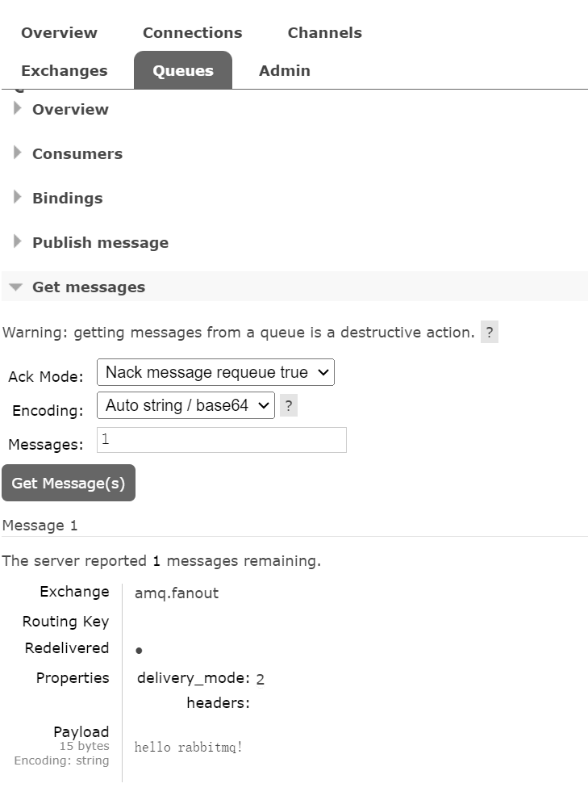

## MQ

**MessageQueue**，即消息对列，是一种应用程序间通信的方法，主要用于分布式系统中实现进程间的解耦、异步处理以及负载均衡等。

消息队列的一些主要特点包括：

1. **异步通信**：发送者发送消息并不需要等待接收者处理完毕，这使得应用能够快速响应，提高了系统的整体性能。
2. **解耦**：生产者和消费者之间不需要直接相互依赖，这意味着即使一方不可用也不会影响另一方的工作。
3. **削峰填谷**：在高峰期，消息队列可以缓存大量消息，防止系统过载；而在低谷期，消费者可以根据自身能力处理消息。
4. **可靠性保证**：通过确认机制来确保消息至少被处理一次，从而提高数据处理的可靠性。
5. **扩展性**：通过添加更多的消费者来处理消息队列中的消息，可以轻松地扩展系统以应对更大的负载。

## RabbitMQ

架构如下：

- Publisher 生产者
- Consumer 消费者
- Exchange 交换机，负责路由消息
- Queue 队列，存储消息，与消费者绑定
- Virtual-host 虚拟主机，隔离数据

### 快速尝试

用docker部署好RabbitMQ后，浏览器访问本地15672端口可以进入RabbitMQ的WebGUI界面。

#### 创建队列

#### 绑定交换机和队列

这里将交换机`amq.fanout`和队列`demo1`绑定

#### 发送消息

#### 查看消息接收

